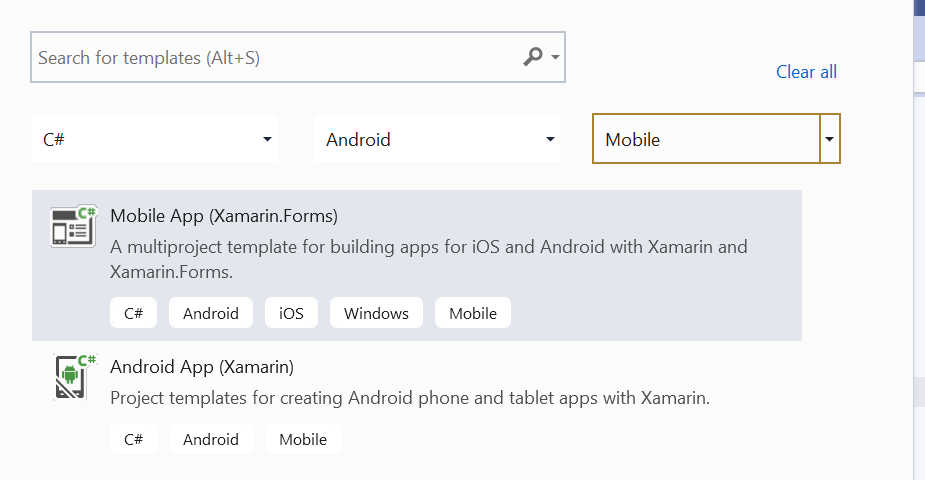
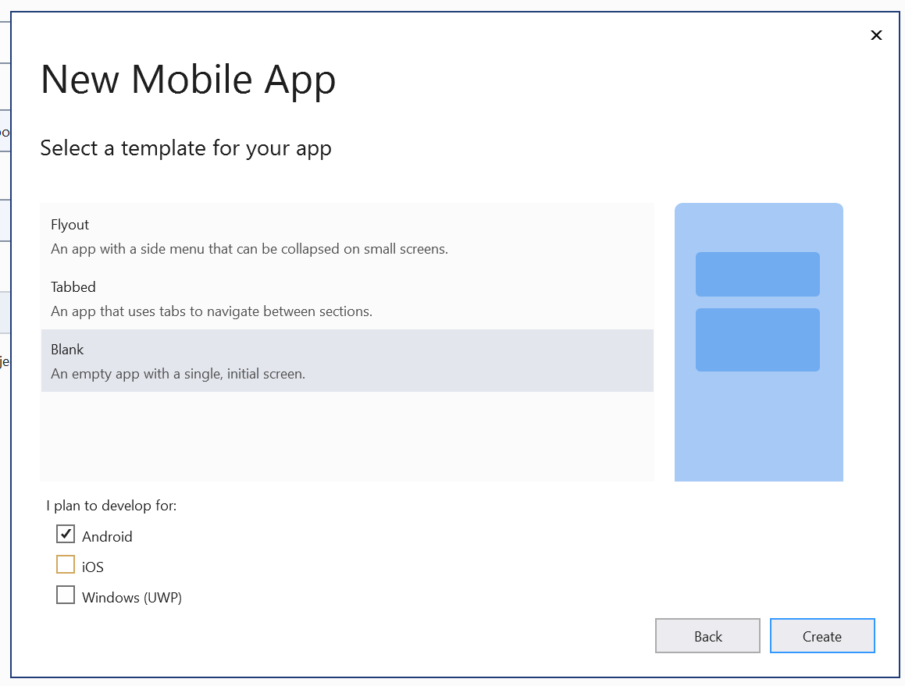
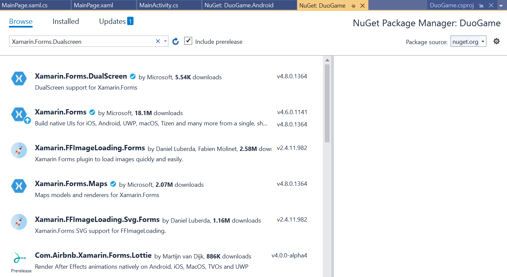
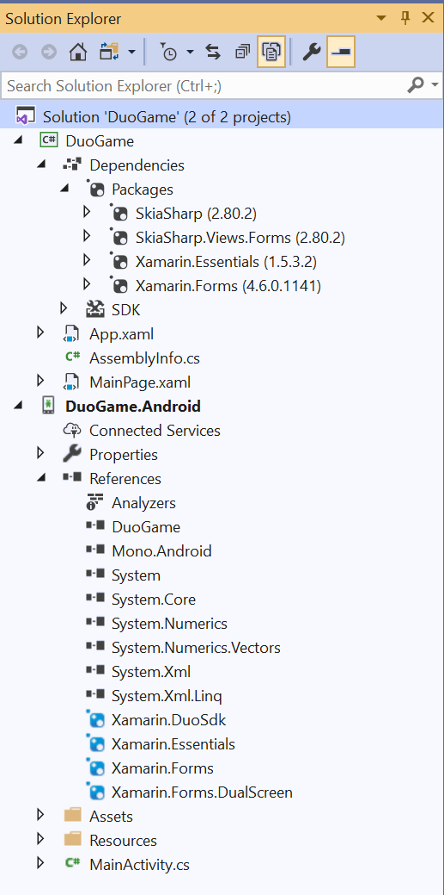
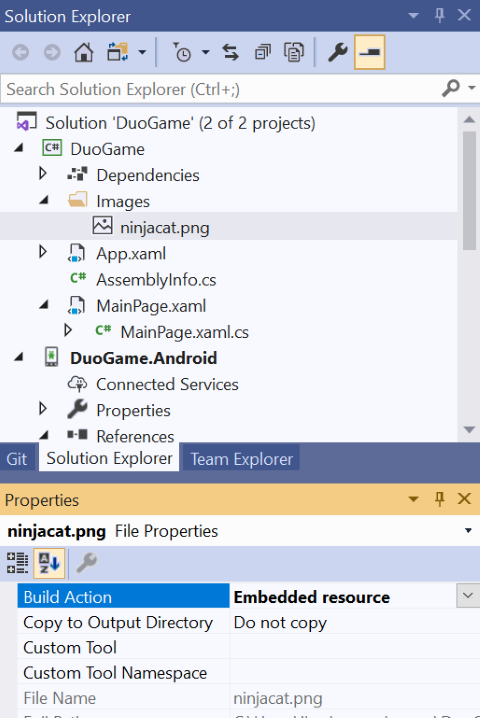
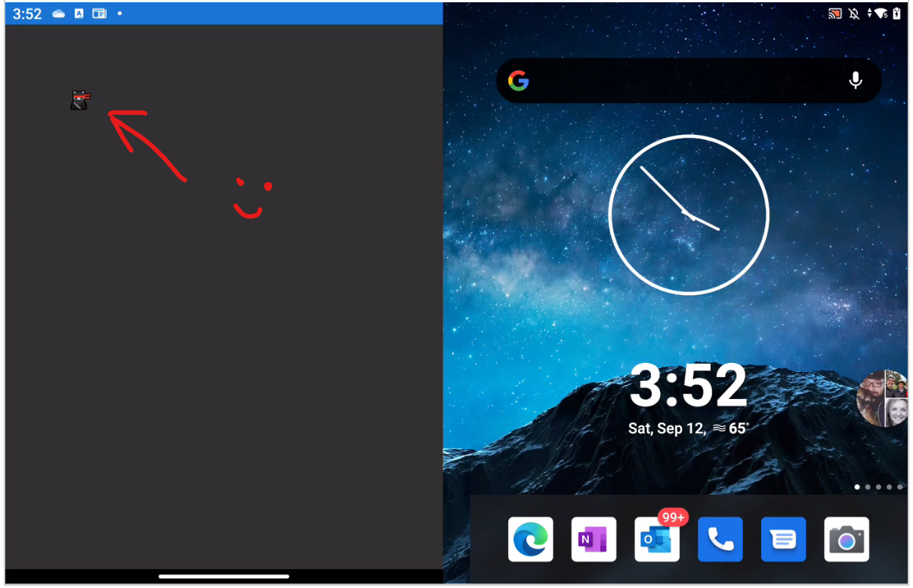

# Writing a game for the Surface Duo

If the release of the Microsoft Surface Duo has tempted you to take a look at Android development, you might be wondering where to begin. Is it really necessary to learn Java, and an entirely way of working with new controls and design patterns?

Well, not necessarily. Xamarin is Microsoft's .NET cross-platform development platform, and it's a great way to write apps for the Surface Duo (and other mobile devices) using tools you probably already know: Visual Studio, C#, and XAML.

Being old-school, I judge how useful a device and platform is by how easy it is to write a game. The good news is that with a few extra libraries, Xamarin is a great choice for writing casual games and I've already got some prototypes running on my Duo.

This document will walk you through creating a Visual Studio project that's ready to start using as the basis of your first Duo game. Or you can simply download the Visual Studio project.


## Install all the tools

In order to create an Xamarin app for the Surface Duo, you will need to install:

1. Install [Visual Studio](https://visualstudio.microsoft.com/) (the Community Edition is fine)
1. Install the [Surface Duo SDK](https://docs.microsoft.com/en-us/dual-screen/android/get-duo-sdk?tabs=windows) (which includes the emulator)

Installing the SDK can be a little involved. Pay particular attention to how the emulator is launched (in case you don't have your Duo just yet).

## Create a new Visual Studio project

Let's create a new project, ready to be your game.

1. Launch Visual Studio, click on **Create a new project** and select the **Mobile App (Xamarin.Forms)** project type.



2. Click **Next**, and name the project **DuoGame** and click **Create**.
3. You now need to select a template for the app. Pick **Blank**, and enable Android and disable the iOS and Windows options (unless you want to go truly cross-platform, of course). 
4. Click **Create**.



## Add the code libraries you will need

The secret to writing games is to pick a library to do all the hard work for you. We're going to use [SkiaSharp](https://github.com/mono/SkiaSharp) for this project, which is distributed in form of a few NuGet libraries.

1. In the Solution Explorer view, find the primary project - **DuoGame** - which is immediately under  **Solution 'DuoGame'**, then right-click it and select **Manage NuGet Packages...**.



2. Click on the **Browse** tab, and then search for and install:

    * **SkiaSharp**
    * **SkiaSharp.Views.Forms**
   
3. Select **DuoGame.Android**, right-click and select **Manage NuGet Packages..**. Again, go to the **Browse** tab, and search for and install:

    * **Xamarin.DuoSdk**
    * **Xamarin.Forms.DualScreen**

If all the NuGet packages are installed properly, your Solution Explorer should look like this:



## Create, initialize and build the first view!

Now we can start to add some C# code to the project to initialize the various views and libraries.

Under the **DuoGame.Android** project look for **MainActivity.cs**, and change the **MainActivity** class to read like this:

```csharp
public class MainActivity : global::Xamarin.Forms.Platform.Android.FormsAppCompatActivity
    {

 protected override void OnCreate(Bundle savedInstanceState)
        {
            TabLayoutResource = Resource.Layout.Tabbar;
            ToolbarResource = Resource.Layout.Toolbar;

            base.OnCreate(savedInstanceState);

            Xamarin.Essentials.Platform.Init(this, savedInstanceState);
            global::Xamarin.Forms.Forms.Init(this, savedInstanceState);
            LoadApplication(new App());
        }
        public override void OnRequestPermissionsResult(int requestCode, string[] permissions, [GeneratedEnum] Android.Content.PM.Permission[] grantResults)
        {
            Xamarin.Essentials.Platform.OnRequestPermissionsResult(requestCode, permissions, grantResults);

            base.OnRequestPermissionsResult(requestCode, permissions, grantResults);
        }
      
    }
```

The bulk of your game code will be in the main DuoGame project, rather than the Android specific project. Find and open **MainPage.xaml** as this will be where we set up the screen display.

Change the XAML to look like this.

```xaml
<?xml version="1.0" encoding="utf-8" ?>
<ContentPage xmlns="http://xamarin.com/schemas/2014/forms"
             xmlns:x="http://schemas.microsoft.com/winfx/2009/xaml"
             xmlns:skia="clr-namespace:SkiaSharp.Views.Forms;assembly=SkiaSharp.Views.Forms"
             xmlns:dualScreen="clr-namespace:Xamarin.Forms.DualScreen;assembly=Xamarin.Forms.DualScreen"
             x:Class="DuoGame.MainPage">

    <Grid >

        <skia:SKCanvasView x:Name="canvasView"  PaintSurface="OnCanvasViewPaintSurface" EnableTouchEvents="True" Touch="OnTouch">
        </skia:SKCanvasView>

    </Grid>

</ContentPage>

```

There's a draw and a touch event in this code, and we'll need to add the methods to the code behind. Open up **MainPage.xaml.cs**, and replace what's there with the following code:

```csharp
using SkiaSharp.Views.Forms;
using System;
using System.Collections.Generic;
using System.ComponentModel;
using System.Linq;
using System.Text;
using System.Threading.Tasks;
using Xamarin.Forms;

namespace DuoGame
{
    public partial class MainPage : ContentPage
    {
        public MainPage()
        {
            InitializeComponent();
        }
        void OnCanvasViewPaintSurface(object sender, SKPaintSurfaceEventArgs args)
        {

        }

        private void OnTouch(object sender, SKTouchEventArgs e)
        {

        }
    }
}
```

And that is the basic framework in place. The project should build (although it won't do anything yet), and you should be able to run it on both the emulators and any Android device you have handy. If you do connect an Android device, remember there are some steps to activate Developer Mode and support debugging over USB:

1. Open the device Settings panel
2. Scroll to **About Phone**
3. Tap on the **Build number** seven times (no, really!)
4. Now to back to the main **Settings** view and you'll see **Developer options**. 
5. Switch on **USB Debugging**. If you are using Visual Studio and don't see the Surface Duo as a deploy target, this is what you've probably forgotten.

## Sad Face :-( I don't have a Surface Duo yet

Don't be too sad, you can still use the built-in emulator. To launch the Surface Duo emulator such that Visual Studio can use it:

1. From the Windows Start menu, select Surface Duo Emulator for Visual Studio

That's it. You should now see it as a deploy target in Visual Studio.


## Review

We've created a new Visual Studio project, and installed the NuGet packages required to use the SkiaSharp game library. At this point, all the code will do is create a blank display, however if just want to download the project at this stage as the basis for your own projects, you'll find it in Files called "DuoGame.zip". Download it, expand it, and load it into Visual Studio. Keep reading if you want to start drawing some graphics.

There are three things we need to worry about: adding the bitmap to the project, loading it into the program at run-time, and finally displaying it. Let's get started.

## Drawing to the SkiaSharp Canvas - Adding the bitmap

Now we've the framework in place, it's time to load some images and draw them on the screen. 

1. Create a new folder under the **DuoGame** project called **Images**. When it comes to loading images, the case used to name files and folders is important.

2. Find your favorite image in PNG format, and drag it into the Images folder.

3. In the image file's properties, set **Build Action** to **Embedded resouce**. It should look like this:



## Drawing to the SkiaSharp Canvas - Loading the bitmap

As I suspect you'll want to use more than one bitmap in your game, let's write a method that will load a bitmap.

Add this method to **Mainpage.xaml.cs**:

```csharp
   public SKBitmap LoadBitmap(string resourceID)
        {
            Assembly assembly = GetType().GetTypeInfo().Assembly;
            using (Stream stream = assembly.GetManifestResourceStream(resourceID))
            {
                if (stream != null)
                {
                    return SKBitmap.Decode(stream);
                }
                return null;
            }

        }
```

Once you add this code you'll see some red-squigglies until various keywords, so use the "Fix it" option to add the right **using** statements to the top of the file.

Create a variable to store the loaded bitmap by adding this line immediately before **public MainPage()** towards the top of the file.

```csharp
SKBitmap ninjaCatBitmap;
```
Now add the method that is called just as the view appears, as this is handy place to load the bitmap:

```csharp
   protected override void OnAppearing()
   {
        base.OnAppearing();
        ninjaCatBitmap = LoadBitmap("DuoGame.Images.ninjacat.png");
   }
```
You might want to build and run this now, because if you have gotten anything wrong, it will fail. Things to check: did you get the casing of the Images folder and file name right? Notice how periods are being used where you might expect slashes. Did you remember to make the image an Embedded Resource?

## Drawing to the SkiaSharp Canvas - Drawing the bitmap

Now we're reading to draw the bitmap.

Replace the existing OnCanvasViewPaintSurface method with this code:

```charp
      void OnCanvasViewPaintSurface(object sender, SKPaintSurfaceEventArgs args)
        {
            SKSurface surface = args.Surface;
            SKCanvas canvas = surface.Canvas;

            // Clear the screen
            canvas.Clear();

            // Draw the bitmap
            canvas.DrawBitmap(ninjaCatBitmap, 200, 200);
        }
```

We've already created the canvas object in the XAML in **MainPage.xaml**, so this method gets a handle to it and then draws our bitmap.



Here you can see the bitmap has been drawn. The Surface Duo screen is really sharp with a lot of pixels, and so the bitmap looks tiny!

## Review

So far we've create the most boring game in the world, entitled "Look at a tiny image". However, it has done several important things:

1. Loaded a bitmap from a resource
2. Drawn a bitmap

And of course, since this is a Surface Duo, you can drag the app to the center of the screen and it will expand to fill the entire view. You can download the project from this point from the files area, and it's called "DuoGameBitmap.zip".

